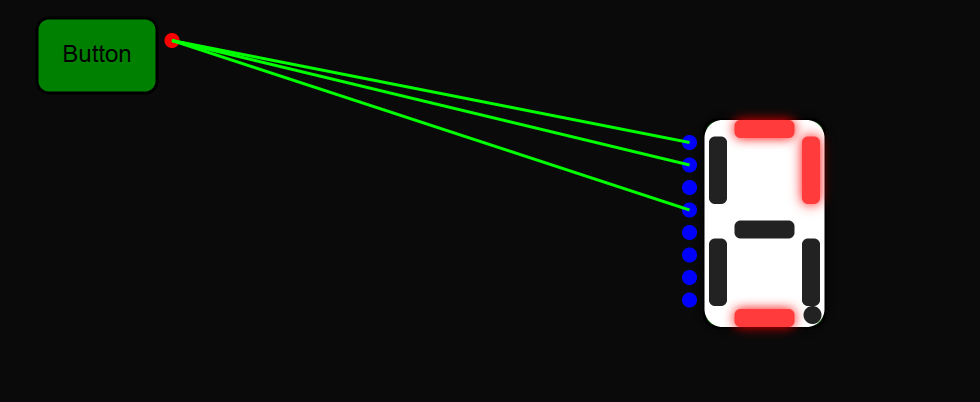
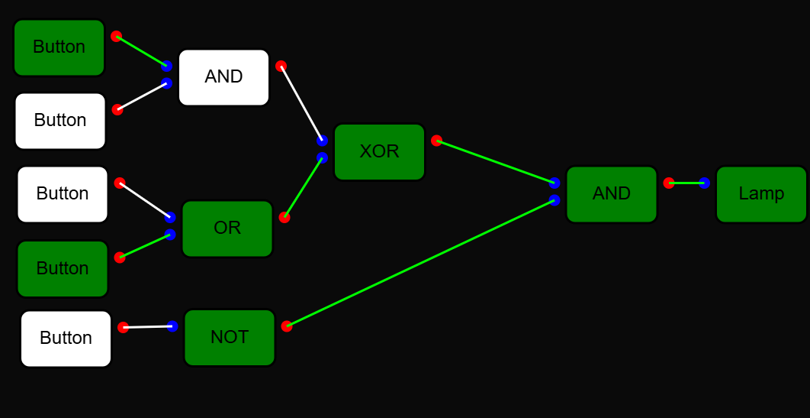

# LMC Circuit

LMC Circuit is an educational web-based binary circuit simulator designed to help users learn about digital logic circuits. The simulator supports various logic gates, interactive components like buttons, and visual results displayed through lamps and 7-segment displays.
Try LMC Circuit [here](https://circuit.lmcgroup.xyz/).

## Features

- **Simulate Binary Circuits**: Users can simulate all basic logic gates (AND, OR, NOT, XOR, etc.) and connect their components in any way they choose.
- **Interactive Components**: Includes buttons, lamps, and 7-segment displays to visualize circuit outputs.
- **Visual Results**: Circuit outputs are shown in real-time on the interactive display.
- **Custom Components**: Users can connect their own custom components to build circuits freely.

## Prerequisites

### For Users
No special framework or library is needed. Just use a modern browser that supports **Next.js 15**.

### For Development
To run the project locally, you need the following:
- Node.js 20
- npm (Node package manager)
- Next.js 15
- React
- Konva.js for interactive components

## Installation

1. Clone the repository:
   ```bash
   git clone https://github.com/lotus64yt/LMC-Circuit.git
   ```

2. Install the dependencies:
   ```bash
   cd lmc-circuit
   npm install
   ```

3. Run the development server:
   ```bash
   npm run dev
   ```

4. Open the simulator in your browser at `http://localhost:3000`.

## Usage

- Simply drag and drop the components like logic gates, buttons, and displays onto the workspace.
- Connect the components using the provided connections.
- Watch the results of your circuit as the logic gates and outputs are simulated visually in real-time.

## Known Bugs

- **Connection between components**: The connection between components has to be first on the output side and then on the input side. If you connect the input first, the connection will not be established.

## Future Improvements

- **Enhanced User Interface**: A more refined UI with drag-and-drop functionality for better component organization and alignment.
- **Simulation Speed Control**: Adding a feature to control the speed of circuit simulations for better experimentation and learning.
- **More Component Types**: Future support for additional components like flip-flops, registers, or multiplexers.
- **Mobile Support**: Improve the simulator's responsiveness for mobile users, ensuring all components are interactable on smaller screens.
- **Better Connection Style**: Implement a better wire style with curves and arrows to show the direction of the connection.


## Screenshots




## Contributing

Feel free to fork the repository and submit pull requests. If you find any bugs or have feature requests, please open an issue on GitHub.

## License

This project is licensed under the MIT License